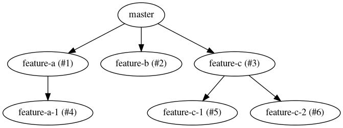
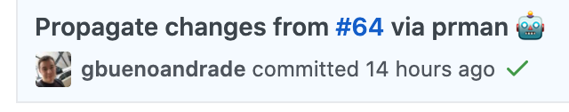
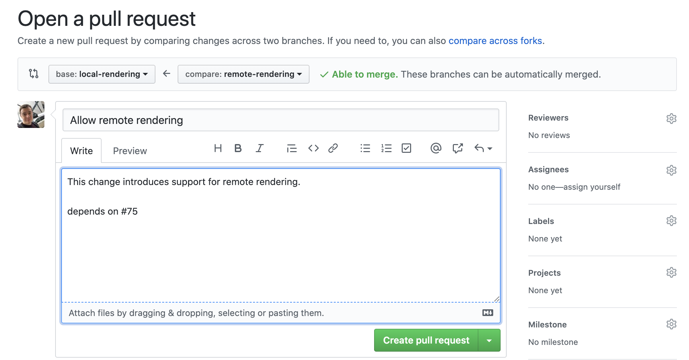
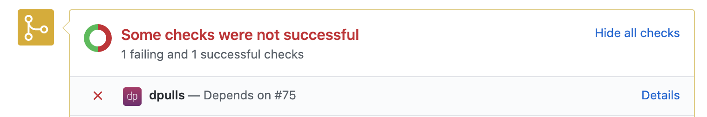

# GitHub Pull Requests Manager

`prman` is a tools that allows the management of pull requests on GitHub, including dependent ones, from the command line.

## Usage

- `prman evolve`

    

    Traverse all open PRs, in topological order, merging base branch into head branch whenever there is a new update.
    The above graph would generate.
    1. `git checkout feature-a; git merge master`
    2. `git checkout feature-b; git merge master`
    3. `git checkout feature-c; git merge master`
    4. `git checkout feature-a-1; git merge feature-a`
    5. `git checkout feature-c-1; git merge feature-c`
    6. `git checkout feature-c-2; git merge feature-c`

    Automated commits

    

- `prman create [-d/--dependency <PR number or head branch>]`

    

    If used alongside [dpulls](https://github.com/marketplace/dpulls), a submission check will be added to your PR.

    

- `prman submit`

## Installation

0. Install [GitHub CLI](https://github.com/cli/cli/blob/trunk/docs/source.md).

   Run `gr pr list` to grant the tool access to your GitHub account.

1. Close this repository
   
   ```sh
   $ git clone https://github.com/gbuenoandrade/github-pr-manager.git
   $ cd github-pr-manager
   ```

2. Create a symbolic link to `main.py` somewhere in your path

   ```sh
   $ sudo ln -s `pwd`/main.py /usr/local/bin/prman
   ```

3. Run `prman -h` to check if it worked.

4. Add `.prman_evolve` to the .gitignore file of your repositiories.
